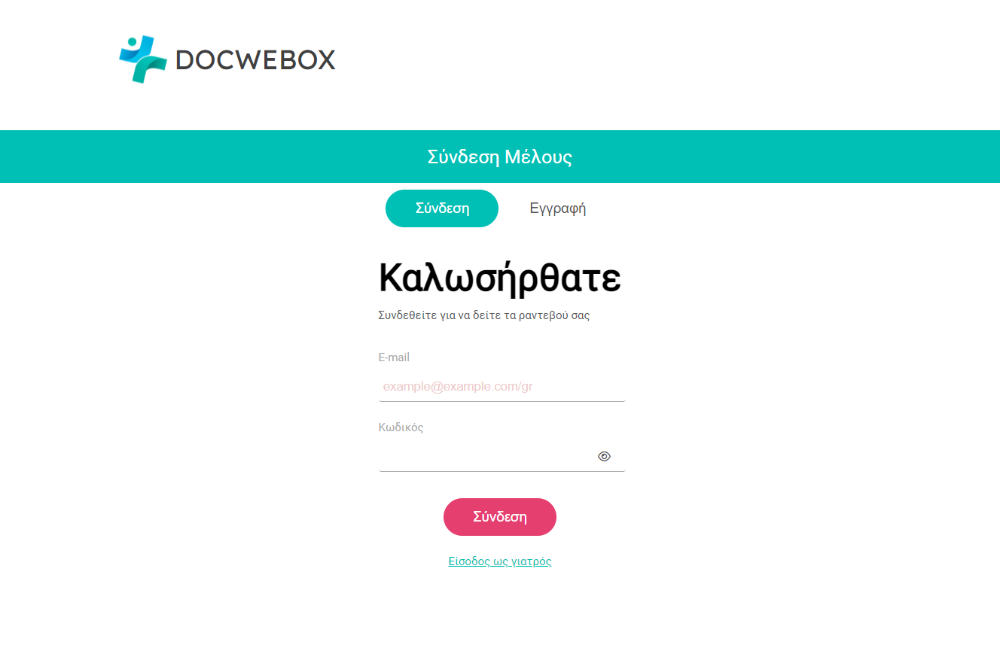
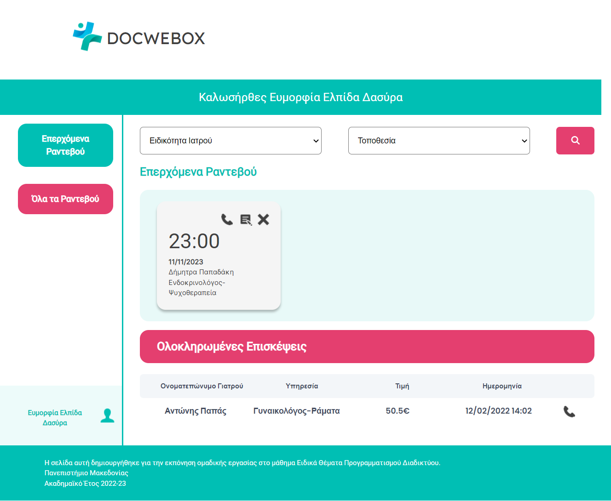
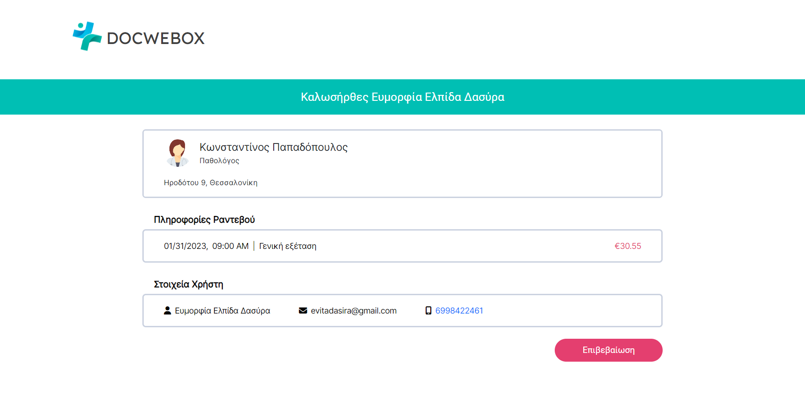

## DocWebox

DocWebox is a helpful, attuned to health needs web application for doctors and users (patients). Users can easily find the most suitable professional, and instantly book an appointment for them. On the other hand, doctors can see their scheduled appointments. Doctors and users can edit, delete their appointments and edit/update their personal information. 

## Univeristy Of Macedonia
This project was created for the needs of our Web Programming lessons in University of Macedonia. The team consists of 6 students who worked together to write code and compose any deliverable assignments throughout the semester.

## Team
* [Αμπατζίδου Ελισάβετ](https://github.com/ElisavetAmpatzidou)
* [Δασύρα Ευμορφία-Ελπίδα](https://github.com/evitadasy)
* [Κουταμάνης Νίκος](https://github.com/NickKoutamanis)
* [Λούστα Αραβέλλα](https://github.com/aravellalousta)
* [Παπαγαλάκης Νεκτάριος](https://github.com/NektariosPapagalakis)
* [Πέπα Λέοναρντ](https://github.com/Leonardpepa)

# File Structure

## DocWebox

- root folder

## Config

- config.php (host, db name, user, password)
- connection.php (συνδεση με την βαση)
- initialize.php (εδω καλείται ο κωδικας την πρωτη φορα που θα τρέξει η εφαρμογη ώστε να δημιουργηθεί η βάση και οι πίνακες)

## Pages
- τα αρχεία που περιέχουν τις οθόνες (View χρήστη γιατρού κτλπ)

## controllers 
- login_controller.php
- register_controller.php
- etc

## Partials ή Components

- header.php
- footer.php
- side_bar.php
- search_bar.php
- (και αλλα)

## JS (Αρχεια Javascript)

## CSS (Αρχεια CSS)

## Services ή Repository (Μέθοδοι CRUD = CREATE, READ, UPDATE, DELETE) για κάθε οντότητα

- admin_db_service.php (αρχειο με μεθοδους για τον admin)
- doctor_db_service.php (αρχειο με μεθοδους για τον doctor)
- patient_db_service.php (αρχειο με μεθοδους για τον patient)
- appointment_db_service.php (αρχειο με μεθοδους για τον appointment)
- doctor_service_db_service.php

## Shared (shared functionality [methods etc.] )

<h2>Results - Screenshots </h2>

  <b>
Login Page:
</b>
    
  <b>
Main Page (user/patient):
</b>
    
  <b>
Confirm Appointment Page
</b>
  

